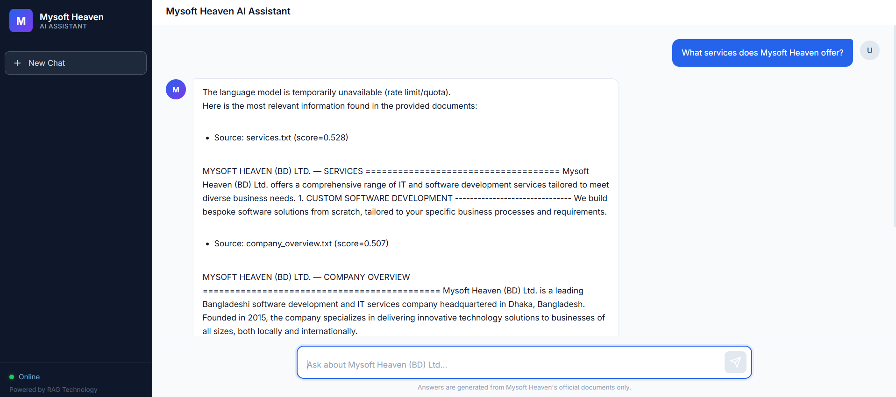
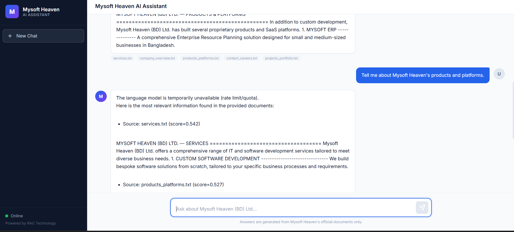
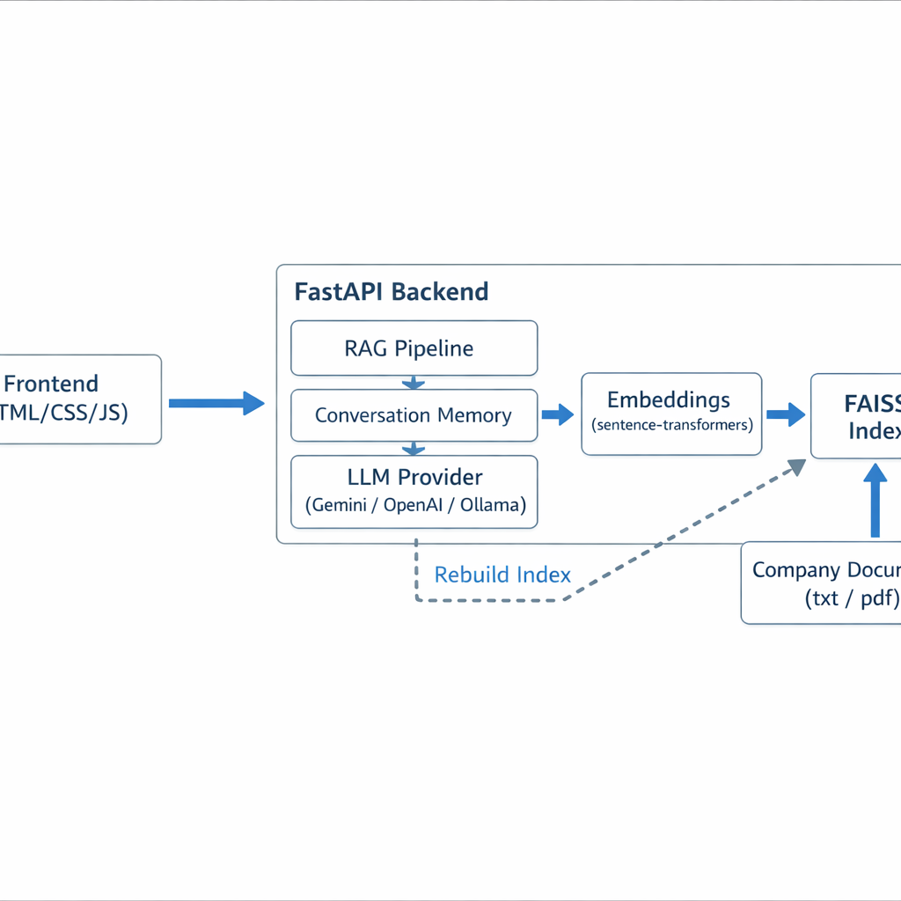

# Mysoft Heaven AI Chatbot

A **Retrieval-Augmented Generation (RAG)** based AI chatbot system built for **Mysoft Heaven (BD) Ltd.** The chatbot answers user questions strictly using company-provided documents — no hallucination, no external knowledge.


---

## Screenshots

### 1) Welcome Screen


### 2) Chat Example (Services)



### 3) Chat Example (Products & Platforms)



## Architecture Diagram



## Project Structure

```
Mysoft_AI_Chatbot/
├── SS/
│   ├── Screenshot 2026-02-12 114457.png # App screenshot (welcome screen)
│   ├── 2.png                  # App screenshot (chat example)
│   ├── 3.png                  # App screenshot (chat example)
│   ├── readme-ui.png           # README mock screenshot (UI)
│   └── readme-architecture.png # README diagram (architecture)
├── backend/
│   ├── main.py              # FastAPI application & endpoints
│   ├── rag.py               # RAG pipeline (retrieve → generate)
│   ├── embeddings.py         # Embedding model & FAISS index management
│   ├── data_loader.py        # Document loading & text chunking
│   ├── config.py             # Centralized configuration
│   ├── requirements.txt      # Python dependencies
│   ├── .env.example          # Environment variables template
│   └── data/
│       └── mysoft_heaven/    # Company documents (txt, pdf)
│           ├── company_overview.txt
│           ├── services.txt
│           ├── products_platforms.txt
│           ├── projects_portfolio.txt
│           └── contact_careers.txt
├── frontend/
│   ├── index.html            # Chat UI structure
│   ├── style.css             # Modern styling
│   └── script.js             # Chat logic & API integration
└── README.md
```

---

## Quick Start

### Prerequisites

- Python 3.10 or higher
- pip (Python package manager)
- An API key for one of: **Google Gemini**, **OpenAI**, or a local LLM (Ollama)

### 1. Install Backend Dependencies

```bash
cd backend
pip install -r requirements.txt
```

For your chosen LLM provider, also install:

```bash
# For Google Gemini (recommended — free tier available)
pip install google-generativeai

# For OpenAI
pip install openai

# For local LLM — install Ollama separately: https://ollama.com
```

### 2. Configure Environment

```bash
# Copy the example env file
# Linux/macOS:
#   cp .env.example .env
#
# Windows (PowerShell):
#   Copy-Item .env.example .env

# Edit .env with your API key
# For Gemini:
#   LLM_PROVIDER=gemini
#   GEMINI_API_KEY=your-key-here
#
# For OpenAI:
#   LLM_PROVIDER=openai
#   OPENAI_API_KEY=your-key-here
```

### 3. Run the Backend

```bash
cd backend
uvicorn main:app --reload --host 0.0.0.0 --port 8000
```

The server starts at `http://localhost:8000`.

### 4. Access the Chatbot

Open your browser and go to:

```
http://localhost:8000/
```

The frontend is served directly by FastAPI. No separate frontend server needed!

### 5. API Usage (Direct)

```bash
curl -X POST http://localhost:8000/chat \
  -H "Content-Type: application/json" \
  -d '{"question": "What services does Mysoft Heaven offer?"}'
```

---

## How to Add New Company Documents

1. Place `.txt` or `.pdf` files in `backend/data/<company_id>/`
   - For Mysoft Heaven: `backend/data/mysoft_heaven/`
2. Rebuild the index via API:
   ```bash
   curl -X POST http://localhost:8000/rebuild-index \
     -H "Content-Type: application/json" \
     -d '{"company_id": "mysoft_heaven"}'
   ```
3. Or simply restart the backend — the index rebuilds on startup if documents changed.

**Tip:** Use clear, well-structured text documents with headings and sections. The chunker works best with organized content.

---

## Architecture & Explanations

### 1. Document Chunking Strategy

```
Document:  [=======================================================]
Chunk 1:   [============]
Chunk 2:        [============]       ← overlaps with Chunk 1
Chunk 3:             [============]  ← overlaps with Chunk 2
```

**Configuration:** 400 characters per chunk, 80 characters overlap.

**Why overlapping chunks?**

| Problem | Solution |
|---------|----------|
| Sentences split across chunk boundaries lose meaning | Overlap ensures both adjacent chunks contain the full sentence |
| A query might match context spanning two chunks | Overlap keeps that bridge context in at least one chunk |
| Too-small chunks lack context | 400 chars ≈ 2-3 sentences — enough for semantic meaning |
| Too-large chunks dilute relevance | Smaller chunks mean the embedding captures focused topics |

The chunker also attempts to break at sentence boundaries (periods, question marks) to avoid mid-sentence splits.

### 2. Embedding Model Choice: `all-MiniLM-L6-v2`

| Criterion | Details |
|-----------|---------|
| **Size** | 80 MB, 22M parameters — runs fast on CPU |
| **Dimension** | 384-dimensional embeddings |
| **Training** | Trained on 1B+ sentence pairs for semantic similarity |
| **Optimization** | Fine-tuned specifically for cosine similarity |
| **Offline** | Runs 100% locally — no API calls, no cost, no latency |
| **Quality** | Top-tier for its size class; widely used in production RAG systems |

**Why not a larger model?** For a company knowledge base (relatively small domain), MiniLM-L6-v2 provides excellent retrieval accuracy. Larger models (e.g., `all-mpnet-base-v2`) offer marginal improvement at 3x the compute cost.

### 3. Handling Irrelevant / Out-of-Scope Queries

The system uses a **three-layer defense** against hallucination:

```
Layer 1: SIMILARITY THRESHOLD
    ↓ Query → FAISS search → Score < 0.25? → REJECT (fallback message)
    ↓
Layer 2: CONFIDENCE SCORING
    ↓ Average score < 0.55? → LOW confidence → Extra caution in prompt
    ↓
Layer 3: SYSTEM PROMPT GUARDRAIL
    ↓ LLM instructed: "Answer ONLY from context. Say 'not found' if unsupported."
    ↓
    ANSWER (grounded in documents)
```

- **Layer 1 — Retrieval Gate:** If cosine similarity of the best chunks is below 0.25, the question is immediately rejected with a fallback message. No LLM call is made.
- **Layer 2 — Confidence Signal:** If chunks pass the threshold but average score is below 0.55, the system adds an extra instruction to the LLM prompt: "Be cautious, the context may not be relevant."
- **Layer 3 — Prompt Engineering:** The system prompt strictly forbids the LLM from using external knowledge, guessing, or hallucinating.

**Fallback message:**
> "I'm unable to answer that as it's outside Mysoft Heaven (BD) Ltd.'s provided information. Please ask questions related to our company, services, or products."

### 4. Multi-Company Scalability Approach

The system is architected for multi-tenant operation from day one:

```
backend/data/
├── mysoft_heaven/          ← Company A documents
│   ├── overview.txt
│   └── services.txt
├── acme_corp/              ← Company B documents (future)
│   ├── about.txt
│   └── products.txt
└── globex_inc/             ← Company C documents (future)
    └── info.txt

backend/faiss_indexes/
├── mysoft_heaven/          ← Separate FAISS index
│   ├── index.faiss
│   └── chunks_meta.json
├── acme_corp/              ← Separate FAISS index
└── globex_inc/             ← Separate FAISS index
```

**How it works:**

1. **Separate data directories** — each company's documents live in `data/<company_id>/`.
2. **Separate FAISS indexes** — each company gets its own vector index. No cross-contamination.
3. **`company_id` parameter** — the `/chat` API accepts a `company_id` field. The RAG pipeline routes to the correct index.
4. **Index registry** — a `CompanyIndex` class manages per-company indexes with lazy loading and caching.

**To add a new company:**

```bash
# 1. Create data directory
mkdir backend/data/new_company

# 2. Add documents
# Linux/macOS:
#   cp documents/*.txt backend/data/new_company/
#
# Windows (PowerShell):
#   Copy-Item documents\\*.txt backend\\data\\new_company\\

# 3. Build index via API
curl -X POST http://localhost:8000/rebuild-index \
  -d '{"company_id": "new_company"}'

# 4. Chat with it
curl -X POST http://localhost:8000/chat \
  -d '{"question": "What does this company do?", "company_id": "new_company"}'
```

**Future scaling enhancements:**
- Database-backed company registry with metadata
- Per-company API key authentication
- Company-specific system prompts and branding
- Index sharding for very large document collections
- Background index rebuilding with queue system

---

## API Reference

### `POST /chat`

Send a question and receive a RAG-grounded answer.

**Request:**
```json
{
  "question": "What services does Mysoft Heaven offer?",
  "company_id": "mysoft_heaven",
  "session_id": "optional-session-id"
}
```

**Response:**
```json
{
  "answer": "Mysoft Heaven offers the following services: ...",
  "confidence": "high",
  "sources": [
    {"filename": "services.txt", "chunk_index": 0, "score": 0.7823}
  ],
  "fallback": false,
  "session_id": "sess_abc123"
}
```

### `POST /rebuild-index`

Rebuild the FAISS index for a company after adding/updating documents.

**Request:**
```json
{
  "company_id": "mysoft_heaven"
}
```

### `GET /health`

Health check endpoint.

---

## Tech Stack

| Component | Technology |
|-----------|-----------|
| Backend Framework | FastAPI (Python) |
| Embeddings | sentence-transformers (`all-MiniLM-L6-v2`) |
| Vector Database | FAISS (local, CPU) |
| LLM | Google Gemini / OpenAI / Ollama (configurable) |
| Frontend | HTML + CSS + JavaScript (vanilla) |
| Document Formats | .txt, .pdf |

---

## Conversation Memory

The system maintains conversation context for the last **5 turns** (configurable). This enables:
- Follow-up questions: "Tell me more about that"
- Contextual references: "What about their pricing?"
- Natural multi-turn dialogue

Memory is session-scoped (via `session_id`). Starting a new chat clears memory.

---

## License

MIT License. Built for Mysoft Heaven (BD) Ltd.
